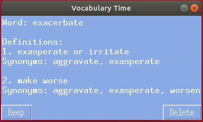

# Task Automation

Ever since I have become more and more obsessed with automation and optimization, I have started to write some scripts to automate daily tasks.

Here are the list of my scripts for automating daily tasks so far: 

This list will be updated.

- `youtube_music_downloader.py`
- `movie_information.py`
- `vocabulary_builder.py`

# Youtube Music Downloader

Lists youtube videos found by the given input video name and downloads user-selected videos

**Required Packages:** 

- pytube
- BeautifulSoup

Here is the command line usage:

`usage: python youtube_music_downloader.py -v [VIDEO_NAME] [OPTIONS]`

`OPTIONS:`
  `-d, --musicDir download directory`
  `-a, --audioOnly audio only flag (default=True)`

**Example usage:** 

`python youtube_music_downloader.py -v Queen Show Must Go`

**Output:**

1. Queen - The Show Must Go On (Official Video)
2. Queen - The Show Must Go On (with lyrics) – In memory of Freddie Mercury
3. The Show Must Go On-Queen Lyrics (HD)

Enter the video id(s) you like to download: <User input> (Ex: 1 3)

------

# Movie Information

Show information (movie title, year, duration, genre, director, plot, etc.) about a movie using [OMDb API](http://www.omdbapi.com/). 

**Required Packages:** 

- requests

Here is the command line usage:

`usage: python movie_information.py [MOVIE_NAME]`

**Example usage:** 

`python movie_information.py Shawshank Redemption`

**Output:**

`Title: The Shawshank Redemption`

`Year: 1994`

`Duration: 142 min`

`Genre: Drama`

`Director: Frank Darabont`

`Actors: Tim Robbins, Morgan Freeman, Bob Gunton, William Sadler`

`Plot: Two imprisoned men bond over a number of years, finding solace and eventual redemption through acts of common decency.`

`IMDB Rating: 9.3/10`

------

# Vocabulary Builder

One of my favorite scripts. It helps you to improve your English vocabulary by keeping track of your unknown words. 

This script builds a dictionary file from your unknown vocabulary words automatically after you get the definition of the word. Then, you can keep track of your unknown words.

It uses  [WordsAPI](https://www.wordsapi.com/)  to get information (definition, synonyms, examples, etc.) about the word. 

**Required Packages:** 

- requests
- tkinter

Here is the command line usage:

`usage: python vocabulary_builder.py [WORD] -o [OPTIONS]`

If no argument is given, it shows a random WORD from your dictionary
If WORD argument is given, it shows the definition of the WORD and saves to your dictionary if not exist

`OPTIONS:`

  `list : list WORDS in your dictionary`

  `delete WORD : deletes the WORD from your dictionary`

  `gui : show a random WORD from your dictionary in GUI`

**Example usage 1**:  Get definition of the word "research"

`python vocabulary_builder.py research`

**Output:**

Word: research

Definitions:
1. inquire into
Synonyms: explore, search
Ex: the students had to research the history of the Second World War for their history project
2. a search for knowledge
Synonyms: enquiry, inquiry
Ex: their pottery deserves more research than it has received
3. attempt to find out in a systematically and scientific manner
Ex: The student researched the history of that word
4. systematic investigation to establish facts

The word "research" is then automatically added to your dictionary file.

**Example usage 2:** List the words in your dictionary file:

`python vocabulary_builder.py -o list`

**Output:**

Vocabulary Words:

efficacy

hamper

dormant

salient

jeopardize

mundane

research

**Example usage 3:** Delete a word from your dictionary file:

`python vocabulary_builder.py -o delete research`

**Output:**

Deleting word 'research' in english_vocabulary.json

Vocabulary Words:

efficacy

hamper

dormant

salient

jeopardize

mundane

**Example usage 4:** Show a random word from your dictionary file in GUI

`python vocabulary_builder.py -o gui`

**Output:**

											

You can add `python vocabulary_builder.py -o gui` command as a cron job on your linux machine if you want to be reminded of your unknown words regularly.

------

 